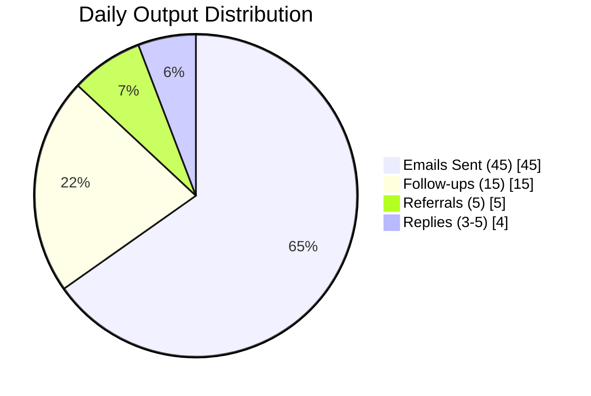

# 🚀 Job Application Automation System v6 - Ultimate Edition

**Production-Ready Automated Job Application System with Cold Email Outreach, Referral Requests, and Multi-Channel Notifications**

[](../../actions)
[](https://www.python.org/)
[](LICENSE)

---

## 🏗️ System Architecture

### 🎯 High-Level Pipeline

```mermaid
flowchart TB
    subgraph SCHEDULER["⏰ GITHUB ACTIONS SCHEDULER"]
        direction LR
        T1["🌅 9:30 AM IST"]
        T2["☀️ 2:30 PM IST"]
        T3["🌙 7:30 PM IST"]
    end

    subgraph SCRAPING["🔍 PHASE 1: JOB SCRAPING"]
        direction TB
        R1["🌐 RemoteOK"]
        R2["💼 Naukri"]
        R3["🔗 LinkedIn"]
        R4["🚀 Wellfound"]
        R1 & R2 & R3 & R4 --> JOBS["📁 jobs_today.csv<br/>50+ jobs/day"]
    end

    subgraph EMAILS["📧 PHASE 2: HR EMAIL DISCOVERY"]
        direction TB
        E1["📚 Curated DB<br/>100+ verified"]
        E2["🔎 HR Finder<br/>LinkedIn/Web"]
        E3["✅ Verifier<br/>MX + Score"]
        E1 & E2 & E3 --> HRLIST["📁 all_hr_emails.csv"]
    end

    subgraph OUTREACH["✉️ PHASE 3: EMAIL CAMPAIGN"]
        direction TB
        O1["📝 Cover Letter<br/>Dear Priya..."]
        O2["🎯 Email Optimizer<br/>A/B Testing"]
        O3["📎 Resume<br/>Auto-attached"]
        O1 --> O2 --> O3 --> SMTP["📤 GMAIL SMTP<br/>15 emails/run"]
    end

    subgraph REFERRAL["🤝 PHASE 3.5: REFERRAL SYSTEM"]
        direction LR
        REF1["🔍 LinkedIn Search"]
        REF2["📧 Email Pattern"]
        REF3["✉️ Referral + Resume"]
        REF1 --> REF2 --> REF3
    end

    subgraph FOLLOWUP["🔄 PHASE 4: SMART FOLLOW-UPS"]
        direction LR
        F1["📅 Day 3<br/>Gentle"]
        F2["📅 Day 7<br/>Firm"]
        F3["📅 Day 14<br/>Final"]
        F1 --> F2 --> F3
        BOUNCE["⚠️ Bounce?"] --> RETRY["🔄 Auto-Retry"]
    end

    subgraph NOTIFY["📱 PHASE 5: NOTIFICATIONS"]
        direction TB
        N1["💬 Slack"]
        N2["📱 WhatsApp"]
        N3["✈️ Telegram"]
        N4["👁️ Open Track"]
    end

    SCHEDULER --> SCRAPING
    SCRAPING --> EMAILS
    EMAILS --> OUTREACH
    EMAILS --> REFERRAL
    OUTREACH --> FOLLOWUP
    REFERRAL --> FOLLOWUP
    FOLLOWUP --> NOTIFY

    style SCHEDULER fill:#e1f5fe
    style SCRAPING fill:#f3e5f5
    style EMAILS fill:#e8f5e9
    style OUTREACH fill:#fff3e0
    style REFERRAL fill:#fce4ec
    style FOLLOWUP fill:#e0f2f1
    style NOTIFY fill:#fffde7
```



### 📊 Data Flow Diagram

```mermaid
flowchart LR
    subgraph INPUT["📂 INPUT"]
        I1["📄 Resume.pdf"]
        I2["⚙️ config.py"]
        I3["📚 HR Database"]
    end

    subgraph PROCESS["⚡ PROCESSING"]
        P1["🔍 Job Scraper"]
        P2["📧 Email Finder"]
        P3["✉️ Email Sender"]
        P4["🤝 Referral System"]
    end

    subgraph OUTPUT["📤 OUTPUT"]
        O1["📁 jobs_today.csv"]
        O2["📁 all_hr_emails.csv"]
        O3["📁 applied_log.csv"]
        O4["📁 referral_log.csv"]
    end

    subgraph NOTIFY["🔔 NOTIFICATIONS"]
        N1["💬 Slack"]
        N2["📱 WhatsApp"]
        N3["✈️ Telegram"]
    end

    I1 & I2 & I3 --> PROCESS
    P1 --> O1
    P2 --> O2
    P3 --> O3
    P4 --> O4
    O3 & O4 --> NOTIFY

    style INPUT fill:#e3f2fd
    style PROCESS fill:#f1f8e9
    style OUTPUT fill:#fff8e1
    style NOTIFY fill:#fce4ec
```



### 🔄 Email Sending Flow

```mermaid
sequenceDiagram
    participant GH as 🤖 GitHub Actions
    participant SC as 🔍 Job Scraper
    participant HR as 📧 HR Finder
    participant EM as ✉️ Email Sender
    participant GM as 📤 Gmail SMTP
    participant SL as 💬 Slack

    GH->>SC: Trigger (3x daily)
    SC->>SC: Scrape RemoteOK, Naukri, LinkedIn
    SC->>HR: jobs_today.csv
    HR->>HR: Find HR emails + Verify
    HR->>EM: all_hr_emails.csv
    EM->>EM: Generate Cover Letter
    EM->>EM: Attach Resume
    loop For each HR email
        EM->>GM: Send Email
        GM-->>EM: Success/Fail
    end
    EM->>SL: 📊 Daily Summary
    SL-->>SL: 🎉 Interview Alert!
```



### 📈 Success Metrics



| Metric | Value | Notes |
|--------|-------|-------|
| 📧 **Emails/Day** | 45 | 15 per run × 3 runs |
| 🤝 **Referrals/Day** | 5 | Auto-discovered employees |
| 📬 **Response Rate** | 8-15% | Higher with referrals |
| 🎯 **Referral Success** | 35% | 10x better than cold |
| 📞 **Interviews/Week** | 2-3 | With consistent usage |

---

## ✨ Features Overview

### Core Features (v1-v2)
| Feature | Description |
|---------|-------------|
| 📧 **Cold Email Outreach** | Sends personalized application emails to verified HR contacts |
| 📋 **100+ Company Emails** | Curated database of HR emails from top Indian & global companies |
| 🔄 **Smart Follow-ups** | Multi-stage follow-ups (Day 3, 7, 14) |
| 📎 **Resume Attachment** | Attaches your resume to every email |
| 🚫 **No Duplicates** | Tracks all sent emails, never emails the same person twice |
| 📬 **Reply Detection** | Monitors inbox for HR responses |
| 🔍 **Multi-Source Scraping** | Jobs from RemoteOK, Naukri, LinkedIn, Wellfound, etc. |

### Advanced Features (v3-v4)
| Feature | Description |
|---------|-------------|
| 🎯 **Email Optimizer** | Personalized company openers, A/B subject testing |
| 👤 **Recruiter Name Finder** | "Dear Priya" instead of "Dear Hiring Manager" |
| 🤝 **Referral System** | 10x higher response rate with auto-referral requests |
| ⏰ **Optimal Send Timing** | Sends during peak hours (Tue-Thu, 9-11 AM) |
| 📝 **Interview Prep** | Auto-generates company research docs |
| 🙏 **Thank You Automation** | Auto-sends thank you emails post-interview |

### Enterprise Features (v5-v6)
| Feature | Description |
|---------|-------------|
| 📊 **ATS Optimizer** | 70%+ keyword match filter |
| 💰 **Salary Intelligence** | Market rate insights |
| ⚡ **Job Priority Engine** | Urgent jobs first |
| 🔗 **LinkedIn Warm-Up** | 3x higher response with connection plans |
| 📱 **Mobile Alerts** | WhatsApp/Telegram instant notifications |
| 👁️ **Email Open Tracking** | Know when HR reads your email |
| 🔄 **Auto-Retry** | Verify & retry failed emails |

---

## 🎯 Quick Start (5 Minutes)

### Step 1: Fork This Repository
Click the "Fork" button to create your own copy.

### Step 2: Add Gmail App Password (REQUIRED)

1. Go to your repo → **Settings** → **Secrets and variables** → **Actions**
2. Click **New repository secret**
3. Add:
   - **Name:** `SENDER_PASSWORD`
   - **Value:** Your Gmail App Password

**Get Gmail App Password:**
1. Go to [myaccount.google.com/security](https://myaccount.google.com/security)
2. Enable **2-Factor Authentication**
3. Go to [myaccount.google.com/apppasswords](https://myaccount.google.com/apppasswords)
4. Create App Password → Copy the 16-character password

### Step 3: Update Your Details

Edit `utils/config.py`:

```python
USER_DETAILS = {
    "full_name": "Your Name",
    "email": "your-email@gmail.com",
    "phone": "+91-XXXXXXXXXX",
    "linkedin_url": "https://linkedin.com/in/your-profile",
    "years_experience": "3",
    "key_skills": "Python, SQL, Data Analysis",
    "target_role": "Data Analyst",
}
```

### Step 4: Add Your Resume

Replace the resume file in `resumes/` folder with your resume PDF.

### Step 5: Run the Workflow!

1. Go to **Actions** tab
2. Click **Job Application System (Ultimate v5)**
3. Click **Run workflow** → Configure options → **Run**

---

## � Configuration Options

When running the workflow manually:

| Option | Description | Default |
|--------|-------------|--------|
| **Job Location** | Target city for job search | Bangalore |
| **Max Emails** | Maximum new emails to send per run | 15 |
| **Send Follow-ups** | Send follow-up emails to past contacts | true |
| **Scrape Only** | Just scrape jobs, don't send emails | false |
| **Include Portfolio Links** | Add GitHub/Portfolio links in emails | false |
| **Send Slack Notifications** | Slack alerts for interviews/summaries | true |
| **Enable Mobile Alerts** | WhatsApp/Telegram notifications | false |
| **Enable WhatsApp** | WhatsApp via CallMeBot | false |
| **Enable Telegram** | Telegram Bot notifications | false |
| **Track Email Opens** | Track if HR opened your email | true |
| **Auto-Retry Failed Emails** | Retry bounced emails with alternates | true |

---

## �📁 Project Structure

```
job-automation/
├── .github/
│   └── workflows/
│       └── apply_jobs.yml          # Main GitHub Actions workflow (14 phases)
│
├── scripts/
│   ├── reliable_job_scraper.py     # Multi-source job scraper (RemoteOK, etc.)
│   ├── naukri_scraper.py           # Naukri.com specific scraper
│   ├── enhanced_job_scraper.py     # LinkedIn, Wellfound, Instahyre
│   ├── linkedin_public_scraper.py  # LinkedIn public job listings
│   │
│   ├── curated_hr_database.py      # 100+ verified HR emails
│   ├── hr_email_finder.py          # Dynamic HR email discovery
│   ├── email_scraper.py            # Extract emails from job postings
│   ├── email_verifier.py           # Verify email deliverability
│   │
│   ├── email_sender.py             # Main email sending engine
│   ├── email_optimizer.py          # A/B testing, personalization
│   ├── cover_letter_generator.py   # AI-powered cover letters
│   │
│   ├── referral_system.py          # Auto-referral requests (NEW!)
│   ├── followup_sender.py          # Multi-stage follow-ups
│   ├── bounce_checker.py           # Detect bounced emails
│   ├── auto_retry_emails.py        # Retry failed emails
│   │
│   ├── reply_detector.py           # Detect HR replies
│   ├── application_tracker.py      # Track application status
│   ├── interview_success_suite.py  # Interview prep & weekly summary
│   │
│   ├── slack_notifier.py           # Slack integration
│   ├── mobile_alerts.py            # WhatsApp/Telegram alerts
│   ├── email_open_tracker.py       # Track email opens
│   │
│   ├── job_priority_engine.py      # Prioritize urgent jobs
│   ├── smart_job_matcher.py        # Skills matching
│   ├── resume_optimizer.py         # Resume keyword analysis
│   └── multi_channel_analytics.py  # Analytics dashboard
│
├── utils/
│   ├── config.py                   # User configuration
│   └── resume_naming.py            # Resume file management
│
├── data/                           # Generated data files
│   ├── jobs_today.csv              # Today's scraped jobs
│   ├── sent_emails_log.csv         # All sent emails
│   ├── referral_requests_log.csv   # Referral tracking
│   ├── hr_replies.csv              # HR responses
│   ├── interview_requests.csv      # Interview detections
│   └── analytics_dashboard.txt     # Analytics report
│
├── resumes/
│   └── [Your_Resume].pdf           # Your resume
│
└── cover_letters/                  # Generated cover letters
```

---

## 📊 Workflow Phases

| Phase | Script | Description |
|-------|--------|-------------|
| 1 | `reliable_job_scraper.py` | Scrape jobs from multiple sources |
| 1.5 | `resume_optimizer.py` | Analyze resume match scores |
| 2 | `curated_hr_database.py` | Load HR email database |
| 3A | `cover_letter_generator.py` | Generate cover letters |
| 3B | `email_sender.py` | Send application emails |
| **3.5** | `referral_system.py` | **Auto-send referral requests** |
| 3.6 | `reply_detector.py` | Detect HR replies |
| 4 | `followup_sender.py` | Send follow-up emails |
| 5 | `bounce_checker.py` | Check for bounced emails |
| 6 | `application_tracker.py` | Update application status |
| 7 | `interview_success_suite.py` | Interview prep & weekly summary |
| 8-10 | `run_analysis_phases.py` | Priority, LinkedIn, Analytics |
| 11 | `slack_notifier.py` | Slack notifications |
| 12 | `auto_retry_emails.py` | Retry failed emails |
| 13 | `email_open_tracker.py` | Email open tracking |
| 14 | `mobile_alerts.py` | WhatsApp/Telegram alerts |

---

## 🔐 Secrets Reference

| Secret | Required | Description |
|--------|----------|-------------|
| `SENDER_PASSWORD` | ✅ **Yes** | Gmail App Password (16 chars) |
| `SLACK_WEBHOOK_URL` | Optional | Slack notifications |
| `WHATSAPP_PHONE` | Optional | Your phone: `+919876543210` |
| `CALLMEBOT_API_KEY` | Optional | CallMeBot API key |
| `TELEGRAM_BOT_TOKEN` | Optional | Telegram Bot token |
| `TELEGRAM_CHAT_ID` | Optional | Your Telegram chat ID |
| `TRACKING_PIXEL_URL` | Optional | Email open tracking endpoint |

---

## 📱 Feature Setup Guide

### 1. Slack Notifications (Recommended)
Get instant Slack alerts when you receive interview requests or HR replies.

**Setup:**
1. Go to [api.slack.com/apps](https://api.slack.com/apps) → Create New App
2. Choose "From scratch" → Name it "Job Alerts" → Select workspace
3. Go to **Incoming Webhooks** → Enable → **Add New Webhook**
4. Select a channel → Copy the Webhook URL
5. Add secret: `SLACK_WEBHOOK_URL` = your webhook URL

**You'll receive:**
- 📊 Daily summary with clickable dashboard link
- 🎯 Interview request alerts (high priority)
- 📬 HR reply notifications
- 🤝 Referral request stats

---

### 2. WhatsApp Alerts (Free via CallMeBot)
Get instant WhatsApp messages for interviews and daily summaries.

**Is it safe?** ✅ Yes!
- No app installation needed
- Only sends messages TO you (can't read your chats)
- No password shared, just phone number + API key
- Block the number anytime to stop

**Setup:**
1. Save **+34 644 51 95 23** in your contacts as "CallMeBot"
2. Send this WhatsApp message to that number:
   ```
   I allow callmebot to send me messages
   ```
3. You'll receive an API key (save it!)
4. Add secrets in GitHub:
   - `WHATSAPP_PHONE` = Your phone with country code (e.g., `+919876543210`)
   - `CALLMEBOT_API_KEY` = The API key you received

**Enable:** Set `enable_mobile_alerts` → `true` and `enable_whatsapp` → `true`

---

### 3. Telegram Alerts
Get Telegram notifications for interviews and summaries.

**Setup:**
1. Message [@BotFather](https://t.me/BotFather) on Telegram
2. Send `/newbot` and follow prompts to create your bot
3. Copy the **Bot Token** you receive
4. Message your new bot (just say "hi")
5. Message [@userinfobot](https://t.me/userinfobot) to get your **Chat ID**
6. Add secrets in GitHub:
   - `TELEGRAM_BOT_TOKEN` = Your bot token
   - `TELEGRAM_CHAT_ID` = Your chat ID

**Enable:** Set `enable_mobile_alerts` → `true` and `enable_telegram` → `true`

---

### 4. Email Open Tracking (Optional)
Know when HR opens your email (requires your own tracking endpoint).

**How it works:**
- Invisible 1x1 pixel is added to emails
- When HR opens email, pixel loads and logs the open
- You can see open rates and who read your emails

**Setup (Advanced):**
1. Set up a tracking endpoint (Vercel, Netlify, or your server)
2. Add secret: `TRACKING_PIXEL_URL` = Your endpoint URL

**Enable:** Set `enable_open_tracking` → `true`

**Alternative (Simpler):** Use [Mailtrack](https://mailtrack.io/) browser extension for Gmail.

---

### 5. Auto-Retry Failed Emails (Enabled by Default)
Automatically retries bounced emails with verified alternate addresses.

**How it works:**
1. Detects bounced/failed emails
2. Finds alternate HR emails for the same company
3. **Verifies alternates before retry:**
   - DNS MX record check (domain exists)
   - Disposable email detection (rejects temp emails)
   - Corporate domain verification
   - Requires 60+ verification score
4. Retries with verified alternate (max 2 per company)

**Enable:** Set `enable_auto_retry` → `true` (default)
**Disable:** Set `enable_auto_retry` → `false`

---

## 📈 Expected Results

| Metric | Expected Range |
|--------|----------------|
| **Emails Sent** | 30-90 per day (3 runs × 30 emails) |
| **Referrals Sent** | 5-10 per run |
| **Open Rate** | 15-25% |
| **Response Rate** | 5-15% (higher with referrals) |
| **Interview Calls** | 1-3 per 100 emails |

---

## 📊 Dashboard & Reports

After each run, you can access:

1. **GitHub Actions Dashboard** - Click the link in Slack notification
2. **Artifacts Download** - CSV files, analytics reports
3. **Available Reports:**
   - `analytics_dashboard.txt` - Full analytics
   - `sent_emails_log.csv` - All emails sent
   - `referral_requests_log.csv` - Referrals sent
   - `interview_requests.csv` - Interview detections
   - `hr_replies.csv` - HR responses
   - `prioritized_jobs.csv` - Jobs by priority

---

## 🏢 Companies in Database

The system includes verified HR emails from 100+ companies:

### Indian IT Giants
Infosys, TCS, Wipro, HCL Tech, Tech Mahindra, Cognizant, Capgemini, Accenture, Deloitte

### Startups (India)
Razorpay, Zerodha, Swiggy, Zomato, CRED, PhonePe, Paytm, Flipkart, Meesho, Groww, Ola, Myntra, Cred

### Global Tech Giants
Google, Microsoft, Amazon, Meta, Apple, Netflix, Uber, Salesforce, Adobe, Oracle, IBM

### Banks & Finance
HDFC Bank, ICICI Bank, Kotak, Axis Bank, Bajaj Finance, Yes Bank

### Consulting & Analytics
McKinsey, BCG, Bain, Fractal Analytics, Mu Sigma, Tiger Analytics

*See full list in `scripts/curated_hr_database.py`*

---

## 🛠️ Troubleshooting

### "Authentication failed" error
- Make sure you're using Gmail App Password, not regular password
- Ensure 2FA is enabled on your Google account

### No emails being sent
- Check if `SENDER_PASSWORD` secret is set correctly
- Look at workflow logs for specific errors

### "No HR emails found" error
- Run the workflow with "Scrape Only" first to populate data

### Referrals not sending
- Normal behavior if no real employees discovered via LinkedIn/Google
- System only sends to verified real emails (no synthetic/guessed emails)

### Slack not working
- Verify `SLACK_WEBHOOK_URL` secret is set correctly
- Test webhook URL in browser

---

## 📝 Adding More Companies

Edit `scripts/curated_hr_database.py`:

```python
{"company": "New Company", "email": "careers@newcompany.com", "type": "general"},
```

---

## 👤 Setting Up for Another Person

If you want to use this automation for someone else (friend, family member, etc.), follow these steps:

---

### 📋 Pre-Setup Checklist

Before starting, collect from the person:

| Required Item | Example | Notes |
|---------------|---------|-------|
| ✅ **Resume PDF** | `Rahul_Sharma_Resume.pdf` | Must be PDF format, under 5MB |
| ✅ **Full Name** | Rahul Sharma | As shown on resume |
| ✅ **Gmail Address** | rahul.sharma@gmail.com | Must be Gmail for SMTP |
| ✅ **Gmail App Password** | `xxxx xxxx xxxx xxxx` | 16-character app password |
| ✅ **Phone Number** | +91-9876543210 | With country code |
| ✅ **LinkedIn URL** | linkedin.com/in/rahul-sharma | Full URL |
| ✅ **Years of Experience** | 5 | Number only |
| ✅ **Target Role** | Data Scientist | Job title they're seeking |
| ✅ **Key Skills** | Python, SQL, ML, TensorFlow | Comma-separated |

---

### 📄 Step 1: Prepare Their Resume

#### Resume Requirements:

```
┌────────────────────────────────────────────────────────────────────┐
│  📄 RESUME CHECKLIST                                               │
├────────────────────────────────────────────────────────────────────┤
│                                                                    │
│  ✅ Format: PDF only (not Word/DOC)                                │
│  ✅ Size: Under 5MB                                                │
│  ✅ Name: Use format: FirstName_LastName_Resume.pdf                │
│           Example: Rahul_Sharma_Resume.pdf                         │
│                                                                    │
│  ✅ Technical Skills Section MUST include:                         │
│     ┌──────────────────────────────────────────────────────────┐   │
│     │  TECHNICAL SKILLS                                        │   │
│     │  ─────────────────                                       │   │
│     │  Languages: Python, SQL, Java, JavaScript                │   │
│     │  Tools: Tableau, Power BI, Excel, Git                    │   │
│     │  Frameworks: TensorFlow, PyTorch, React, Django          │   │
│     │  Cloud: AWS, Azure, GCP                                  │   │
│     │  Databases: MySQL, PostgreSQL, MongoDB                   │   │
│     └──────────────────────────────────────────────────────────┘   │
│                                                                    │
│  ⚠️  Keywords in resume = Better job matching!                     │
│     The system uses these keywords to match with job descriptions  │
│                                                                    │
└────────────────────────────────────────────────────────────────────┘
```

#### Place Resume in Correct Location:

```
resumes/
├── Rahul_Sharma_Resume.pdf    <── Add their resume here
└── tailored/                  <── Auto-generated tailored versions go here
```

---

### ⚙️ Step 2: Update `utils/config.py`

Edit the file with their details:

```python
# --- Path Configuration ---
BASE_RESUME_PATH = os.path.join(RESUMES_DIR, "Rahul_Sharma_Resume.pdf")  # ⬅️ Change filename

# --- User Application Details ---
USER_DETAILS = {
    # Basic Info
    "full_name": "Rahul Sharma",                    # ⬅️ Full name as on resume
    "first_name": "Rahul",                          # ⬅️ First name only
    "last_name": "Sharma",                          # ⬅️ Last name only
    "email": "rahul.sharma@gmail.com",              # ⬅️ Their Gmail address
    "phone": "+91-9876543210",                      # ⬅️ With country code
    
    # Location
    "location": "Mumbai, Maharashtra, India",       # ⬅️ Full location
    "city": "Mumbai",                               # ⬅️ City name
    "country": "India",                             # ⬅️ Country
    "work_authorization": "Authorized to work in India",
    
    # Professional Links
    "linkedin_url": "https://www.linkedin.com/in/rahul-sharma/",
    "github_url": "https://github.com/rahul-sharma",         # Optional
    "portfolio_url": "https://rahulsharma.dev",              # Optional
    "kaggle_url": "",                                        # Optional
    
    # Experience & Skills (IMPORTANT for job matching!)
    "years_experience": "5",                        # ⬅️ Total years
    "target_role": "Data Scientist",                # ⬅️ Job title seeking
    "key_skills": "Python, SQL, Machine Learning, TensorFlow, Deep Learning",
    "key_projects": "Fraud Detection System, Customer Churn Model",  # Optional
}
```

---

### 🔐 Step 3: Update GitHub Secrets

Go to **Repository → Settings → Secrets and variables → Actions → New repository secret**

#### Required Secrets:

| Secret Name | Value | Example |
|-------------|-------|---------|
| `SENDER_EMAIL` | Their Gmail address | `rahul.sharma@gmail.com` |
| `SENDER_PASSWORD` | Gmail App Password (16 chars) | `abcd efgh ijkl mnop` |
| `APPLICANT_NAME` | Full name | `Rahul Sharma` |
| `APPLICANT_EMAIL` | Email address | `rahul.sharma@gmail.com` |
| `APPLICANT_PHONE` | Phone with country code | `+91-9876543210` |
| `APPLICANT_LINKEDIN` | LinkedIn profile URL | `https://linkedin.com/in/rahul-sharma` |
| `APPLICANT_EXPERIENCE` | Years of experience | `5` |
| `APPLICANT_SKILLS` | Comma-separated skills | `Python, SQL, ML, TensorFlow` |
| `APPLICANT_TARGET_ROLE` | Target job title | `Data Scientist` |
| `RESUME_PATH` | Path to resume file | `resumes/Rahul_Sharma_Resume.pdf` |

#### Optional Secrets (for notifications):

| Secret Name | Value | How to Get |
|-------------|-------|------------|
| `SLACK_WEBHOOK_URL` | Slack webhook URL | Create at api.slack.com |
| `WHATSAPP_PHONE` | Phone number | Their WhatsApp number |
| `CALLMEBOT_API_KEY` | API key | From CallMeBot |
| `TELEGRAM_BOT_TOKEN` | Bot token | From @BotFather |
| `TELEGRAM_CHAT_ID` | Chat ID | From @userinfobot |

---

### ✅ Step 4: Final Verification Checklist

```
┌────────────────────────────────────────────────────────────────────┐
│  ✅ FINAL CHECKLIST BEFORE RUNNING                                 │
├────────────────────────────────────────────────────────────────────┤
│                                                                    │
│  □ Resume PDF placed in resumes/ folder                            │
│  □ Resume filename matches BASE_RESUME_PATH in config.py           │
│  □ Resume has clear "Technical Skills" section with keywords       │
│  □ USER_DETAILS updated with correct info                          │
│  □ SENDER_EMAIL secret set (their Gmail)                           │
│  □ SENDER_PASSWORD secret set (App Password, NOT regular password) │
│  □ All APPLICANT_* secrets configured                              │
│  □ RESUME_PATH secret matches actual file path                     │
│  □ (Optional) Notification secrets configured                      │
│                                                                    │
└────────────────────────────────────────────────────────────────────┘
```

---

### 🚀 Step 5: Run the Workflow

1. Go to **Actions** tab
2. Click **Job Application System (Ultimate v5)**
3. Click **Run workflow**
4. Set options:
   - Job Location: `Mumbai` (or their city)
   - Max Emails: `10` (start small to test)
   - Scrape Only: `false`
5. Click **Run workflow**

---

### ⚠️ Common Mistakes to Avoid

| Mistake | Problem | Solution |
|---------|---------|----------|
| Wrong resume filename | Emails go without attachment | Ensure `BASE_RESUME_PATH` matches exactly |
| Using regular Gmail password | Authentication fails | Must use 16-char App Password |
| Resume without keywords | Poor job matching | Add clear Technical Skills section |
| Resume over 5MB | Attachment fails | Compress or optimize PDF |
| Missing country code in phone | Invalid format | Use `+91-` prefix for India |

---

## 💡 Tips for Better Results

- **Customize your resume** for target roles
- **Update `USER_DETAILS`** with accurate experience
- **Run daily** for consistent outreach
- **Let follow-ups run automatically** - they increase response rate by 40%
- **Enable Slack notifications** to catch interview requests immediately
- **Add portfolio/GitHub links** if you have relevant projects

---

## ⚠️ Important Notes

1. **Use responsibly** - Don't spam. The system has built-in rate limiting.
2. **Gmail App Password** - Regular password won't work. Must use App Password.
3. **Email limits** - Gmail allows ~500 emails/day. Stay well under this.
4. **Resume** - Keep PDF under 5MB for reliable attachment.

---

## ⚖️ Disclaimer

This tool is for personal use only. Users are responsible for:
- Complying with anti-spam laws
- Respecting company policies
- Not exceeding email sending limits
- Using accurate personal information

---

## 📝 License

MIT License - See [LICENSE](LICENSE) file.

---

## 🤝 Contributing

1. Fork the repository
2. Create feature branch (`git checkout -b feature/amazing`)
3. Commit changes (`git commit -m 'Add amazing feature'`)
4. Push to branch (`git push origin feature/amazing`)
5. Open Pull Request

---

**Made with ❤️ for job seekers**
