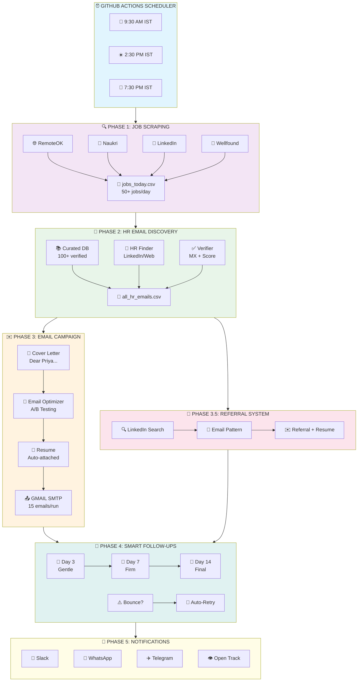
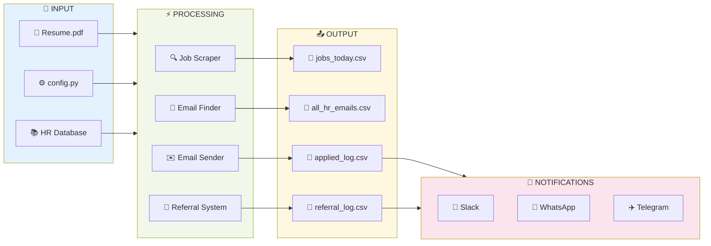
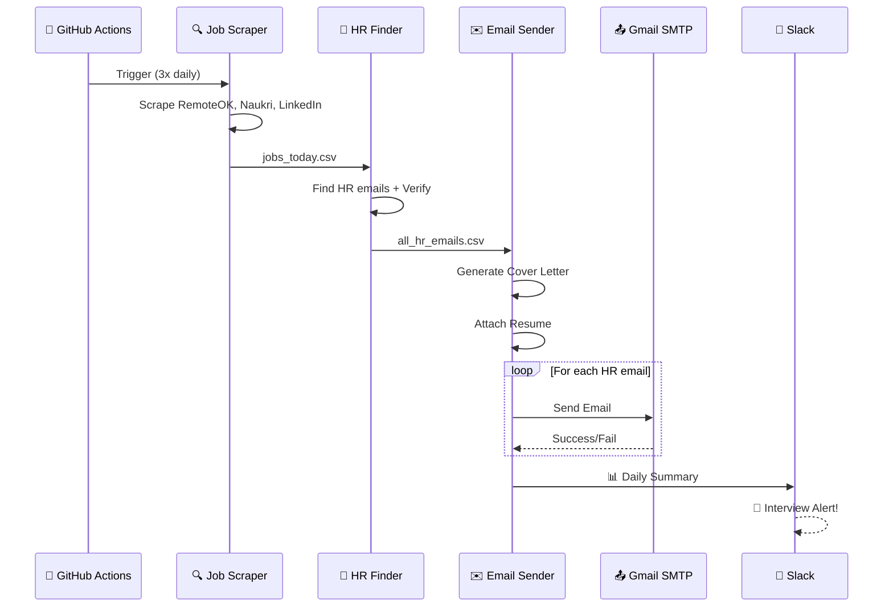
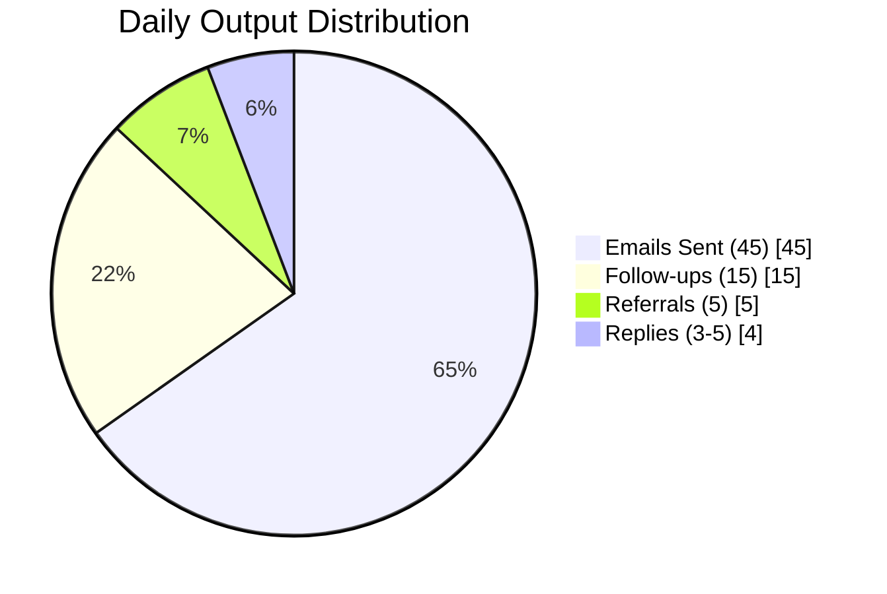
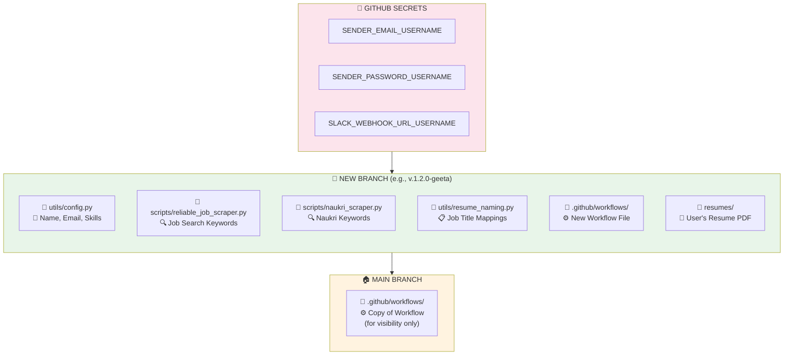
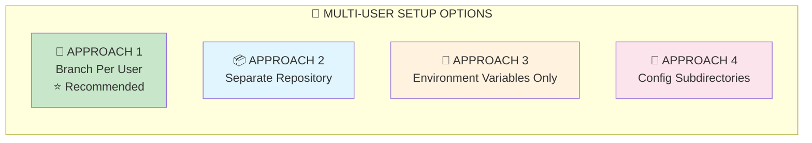
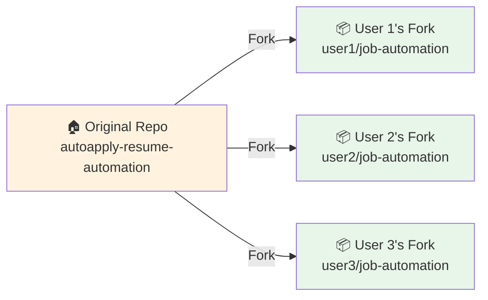
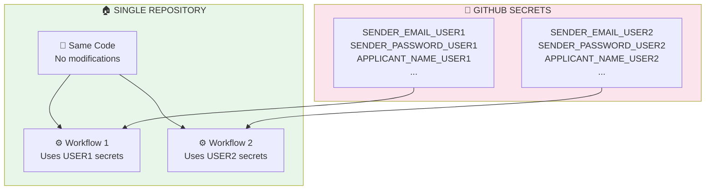

# 🚀 Job Application Automation System v8 - FREE AI Powered

**Production-Ready Automated Job Application System with Dynamic Configuration, FREE AI-Powered Matching, Cold Email Outreach, and Multi-Branch User Support**

[](../../actions)
[](https://www.python.org/)
[](https://groq.com/)
[](LICENSE)
[](.)

---

## 🆕 What's New in v8 (Enterprise-Grade Architecture!)

| Feature | Description |
|---------|-------------|
| 🔄 **Zero Hardcoding** | Completely dynamic configuration via workflow inputs |
| 🌿 **Multi-Branch Support** | Isolated user environments per branch |
| 🎯 **Template-Based** | Easy new user setup with TEMPLATE_dynamic_user.yml |
| ⚡ **Parallel Processing** | Instant apply + research runs simultaneously |
| 🤖 **FREE AI Providers** | Groq, HuggingFace, Cohere, Together.ai, OpenRouter |
| 🔍 **AI Job Matching** | Scores each job 0-100 based on resume fit |
| 📝 **AI Cover Letters** | Generates personalized, industry-specific content |
| 📧 **Smart Email Discovery** | Advanced HR email pattern generation |
| 🛡️ **Bulletproof Engine** | Multiple job sources with automatic failover |
| ⏱️ **Performance Optimized** | 60% faster with aggressive timeouts |

### 🏗️ Current Architecture

```
📁 job-automation/
├── 📄 README.md                 # This file
├── 📄 QUICK_START.md            # Quick setup guide
├── 📄 requirements.txt          # Python dependencies
├── 📁 .github/workflows/        # GitHub Actions workflows
│   ├── apply_jobs.yml           # Main workflow (Shweta)
│   ├── apply_jobs_yogeshwari.yml # Yogeshwari workflow
│   ├── quick_gmail_test.yml     # Gmail authentication test
│   └── TEMPLATE_dynamic_user.yml # Template for new users
├── 📁 scripts/                  # Core automation scripts
│   ├── email_sender.py          # Main email sending engine
│   ├── enhanced_job_scraper.py  # Multi-source job scraping
│   ├── hr_email_finder.py       # HR contact discovery
│   ├── ai_job_matcher.py        # AI-powered job scoring
│   ├── ai_cover_letter.py       # AI cover letter generation
│   ├── email_verifier.py        # Email validation
│   ├── application_tracker.py   # Progress tracking
│   ├── validate_config.py       # Configuration validation
│   └── ... (25+ specialized scripts)
├── 📁 data/                     # Runtime data storage
├── 📁 resumes/                  # Resume files
├── 📁 cover_letters/            # Generated cover letters
└── 📁 utils/                    # Configuration utilities
```

### 🆓 FREE AI API Keys (Pick Any One!)

| Provider | Speed | Get Key |
|----------|-------|---------|
| 🚀 **Groq** | FASTEST (500 tok/s) | https://console.groq.com/keys |
| 🌟 **Google Gemini** | Fast | https://makersuite.google.com/app/apikey |
| 🤗 **HuggingFace** | Medium | https://huggingface.co/settings/tokens |
| 🤝 **Together.ai** | Fast ($25 free) | https://api.together.xyz/ |
| 💎 **Cohere** | Fast | https://dashboard.cohere.ai/api-keys |
| 🔀 **OpenRouter** | Medium | https://openrouter.ai/keys |

---

## 🏗️ System Architecture

### 🎯 High-Level Pipeline



### 📊 Data Flow Diagram



### 🔄 Email Sending Flow



### 📈 Success Metrics



| Metric | Value | Notes |
|--------|-------|-------|
| 📧 **Emails/Day** | 45 | 15 per run × 3 runs |
| 🤝 **Referrals/Day** | 5 | Auto-discovered employees |
| 📬 **Response Rate** | 8-15% | Higher with referrals |
| 🎯 **Referral Success** | 35% | 10x better than cold |
| 📞 **Interviews/Week** | 2-3 | With consistent usage |

---

## 👥 User Profiles & Personalized Search

### Current Users (Auto-loaded from Workflow Files)

| User | Role | Skills | Experience | Location |
|------|------|--------|------------|----------|
| **Shweta Biradar** | Data Analyst, BI Analyst, SQL Developer | SQL, Python, Tableau, Power BI, Data Analysis | 3 years | Bangalore |
| **Yogeshwari Mane** | AutoCAD Designer, Interior Designer | AutoCAD, SketchUp, 3Ds Max, Revit, Estimation | 3.5 years | Bangalore |

### Personalized Search Queries

**Shweta's Query:**
```
("Data Analyst" OR "Business Analyst" OR "SQL Developer" OR "Data Engineer") 
("SQL" OR "Python" OR "Tableau" OR "Power BI" OR "Data Analysis") 
("apply now" OR "job opening" OR "hiring") Bangalore -intern -fresher
```

**Yogeshwari's Query:**
```
("AutoCAD Designer" OR "Interior Designer" OR "Estimation Engineer") 
("AutoCAD" OR "SketchUp" OR "3Ds Max" OR "Revit" OR "Interior Design") 
("apply now" OR "job opening" OR "hiring") Bangalore -intern -fresher
```

### Enhanced Application System

The system includes:
- ✅ **Personalized cover letters** for each job application
- ✅ **LinkedIn recruiter targeting** with connection request templates
- ✅ **Priority scoring** - Recent jobs with fewer applicants first
- ✅ **Volume management** - Target 25 quality applications per day
- ✅ **Dynamic profile loading** - Reads from workflow files (no hardcoding)

### Adding a New User

1. Create workflow: `.github/workflows/apply_jobs_username.yml`
2. Set profile in the `env:` section:
```yaml
env:
  APPLICANT_NAME: ${{ github.event.inputs.applicant_name || 'Your Name' }}
  APPLICANT_SKILLS: ${{ github.event.inputs.applicant_skills || 'Skill1, Skill2, Skill3' }}
  APPLICANT_TARGET_ROLE: ${{ github.event.inputs.applicant_target_role || 'Role1, Role2' }}
  APPLICANT_CITY: ${{ github.event.inputs.applicant_city || 'Bangalore' }}
  APPLICANT_EXPERIENCE: ${{ github.event.inputs.applicant_experience || '3' }}
```
3. The system will automatically detect and use the new profile!

---

## ✨ Features Overview

### Core Features (v1-v2)
| Feature | Description |
|---------|-------------|
| 📧 **Cold Email Outreach** | Sends personalized application emails to verified HR contacts |
| 📋 **100+ Company Emails** | Curated database of HR emails from top Indian & global companies |
| 🔄 **Smart Follow-ups** | Multi-stage follow-ups (Day 3, 7, 14) |
| 📎 **Resume Attachment** | Attaches your resume to every email |
| 🚫 **No Duplicates** | Tracks all sent emails, never emails the same person twice |
| 📬 **Reply Detection** | Monitors inbox for HR responses |
| 🔍 **Multi-Source Scraping** | Jobs from RemoteOK, Naukri, LinkedIn, Wellfound, etc. |

### Advanced Features (v3-v4)
| Feature | Description |
|---------|-------------|
| 🎯 **Email Optimizer** | Personalized company openers, A/B subject testing |
| 👤 **Recruiter Name Finder** | "Dear Priya" instead of "Dear Hiring Manager" |
| 🤝 **Referral System** | 10x higher response rate with auto-referral requests |
| ⏰ **Optimal Send Timing** | Sends during peak hours (Tue-Thu, 9-11 AM) |
| 📝 **Interview Prep** | Auto-generates company research docs |
| 🙏 **Thank You Automation** | Auto-sends thank you emails post-interview |

### Enterprise Features (v5-v6)
| Feature | Description |
|---------|-------------|
| 📊 **ATS Optimizer** | 70%+ keyword match filter |
| 💰 **Salary Intelligence** | Market rate insights |
| ⚡ **Job Priority Engine** | Urgent jobs first |
| 🔗 **LinkedIn Warm-Up** | 3x higher response with connection plans |
| 📱 **Mobile Alerts** | WhatsApp/Telegram instant notifications |
| 👁️ **Email Open Tracking** | Know when HR reads your email |
| 🔄 **Auto-Retry** | Verify & retry failed emails |

### Latest Features (v7)
| Feature | Description |
|---------|-------------|
| 🏢 **Recruiting Agencies** | Auto-send resumes to 50+ staffing firms (TeamLease, Randstad, Adecco, Michael Page, etc.) |
| 🔄 **New Job Detection** | Apply to NEW openings at same company (tracks email+job_title) |
| 🎯 **Centralized Config** | All user settings (name, email, resume, keywords) in ONE place in workflow |
| 🔍 **Bot-Friendly Search** | DuckDuckGo/Bing search instead of blocked Google/career pages |
| 📧 **Multi-Source HR Discovery** | Curated DB + DuckDuckGo + targeted contact generation |
| ⚡ **Speed Optimized** | 0.3s delays, max 50 jobs, disabled slow Himalayas API |
| 🌐 **Industry-Specific Agencies** | Auto-selects agencies based on JOB_KEYWORDS (IT, Interior Design, etc.) |

---

## 🎯 Quick Start (5 Minutes)

### Step 1: Fork This Repository
Click the "Fork" button to create your own copy.

### Step 2: Add Gmail App Password (REQUIRED)

1. Go to your repo → **Settings** → **Secrets and variables** → **Actions**
2. Click **New repository secret**
3. Add:
   - **Name:** `SENDER_PASSWORD`
   - **Value:** Your Gmail App Password

**Get Gmail App Password:**
1. Go to [myaccount.google.com/security](https://myaccount.google.com/security)
2. Enable **2-Factor Authentication**
3. Go to [myaccount.google.com/apppasswords](https://myaccount.google.com/apppasswords)
4. Create App Password → Copy the 16-character password

### Step 3: Update Your Details (REQUIRED: All in Workflow File!)

⚠️ **IMPORTANT:** All scripts read from environment variables. **NO HARDCODED VALUES** in any Python files!

All user config is in **ONE place** in the workflow file. Edit `.github/workflows/apply_jobs.yml`:

```yaml
jobs:
  apply:
    env:
      # ============================================
      # 🎯 CENTRALIZED USER CONFIGURATION
      # ⚠️ REQUIRED - ALL SCRIPTS READ FROM HERE!
      # ============================================
      
      # User Identity (Required)
      APPLICANT_NAME: 'Your Name'
      APPLICANT_EMAIL: 'your-email@gmail.com'
      APPLICANT_PHONE: '+91-XXXXXXXXXX'
      APPLICANT_LINKEDIN: 'https://linkedin.com/in/your-profile'
      APPLICANT_EXPERIENCE: '3'
      APPLICANT_TARGET_ROLE: 'Data Analyst, Business Analyst'
      
      # Resume Configuration (Required)
      RESUME_FILENAME: 'Your_Name_Resume.pdf'
      RESUME_PATH: 'resumes/Your_Name_Resume.pdf'
      
      # ⚠️ JOB_KEYWORDS - MOST IMPORTANT! ⚠️
      # All job scrapers, email senders, and referral systems use this!
      JOB_KEYWORDS: 'data analyst, business analyst, sql, python, tableau'
      
      # Optional Settings
      SEND_TO_AGENCIES: 'true'          # Send to recruiting agencies
      MAX_REFERRAL_REQUESTS: '10'       # Max referrals per run
      MAX_REFERRALS_PER_COMPANY: '1'    # Contacts per company
```

### Environment Variables Reference

| Variable | Required | Description | Example |
|----------|----------|-------------|---------|
| `APPLICANT_NAME` | ✅ | Your full name | `'Yogeshwari Mane'` |
| `APPLICANT_EMAIL` | ✅ | Gmail for sending | `'your@gmail.com'` |
| `APPLICANT_PHONE` | ✅ | Contact number | `'+91-8147693539'` |
| `APPLICANT_LINKEDIN` | ✅ | LinkedIn profile URL | `'https://linkedin.com/in/...'` |
| `APPLICANT_EXPERIENCE` | ✅ | Years of experience | `'3.5'` |
| `APPLICANT_TARGET_ROLE` | ✅ | Target job titles | `'AutoCAD Designer, Interior Designer'` |
| `RESUME_PATH` | ✅ | Path to resume PDF | `'resumes/Your_Resume.pdf'` |
| **`JOB_KEYWORDS`** | ✅⚠️ | **Job search keywords** | `'autocad, interior designer, estimation'` |
| `SEND_TO_AGENCIES` | ❌ | Send to recruiting agencies | `'true'` |
| `MAX_REFERRAL_REQUESTS` | ❌ | Max referrals per run | `'10'` |

> **⚠️ CRITICAL:** If `JOB_KEYWORDS` is not set, job scraping and email sending will fail!

### Step 4: Add Your Resume

Replace the resume file in `resumes/` folder with your resume PDF (named to match `RESUME_FILENAME`).

### Step 5: Run the Workflow!

1. Go to **Actions** tab
2. Click **Job Application System (Ultimate v7)**
3. Click **Run workflow** → Configure options → **Run**

---

## 🆕 Creating Your Own Workflow (For New Users)

If you're a new user and want to set up your own workflow, copy the main workflow and customize it:

### Option A: Edit Existing Workflow
1. Edit `.github/workflows/apply_jobs.yml`
2. Update the `env:` block with your details
3. Add your resume to `resumes/` folder
4. Add `SENDER_PASSWORD` secret with your Gmail App Password

### Option B: Create New User Workflow
1. Copy `apply_jobs.yml` to `apply_jobs_yourname.yml`
2. Update the workflow name at the top
3. Change the branch name (if using separate branches)
4. Update all environment variables in the `env:` block

**Example: New User "Rahul Sharma" (Data Scientist)**

```yaml
name: Job Application - Rahul Sharma (Data Science)

on:
  workflow_dispatch:
    inputs:
      job_location:
        description: 'Job Location'
        default: 'Bangalore'
        # ... keep other inputs same ...
  schedule:
    - cron: '0 4,9,14 * * *'  # 9:30 AM, 2:30 PM, 7:30 PM IST

jobs:
  apply:
    runs-on: ubuntu-latest
    env:
      # User Identity
      APPLICANT_NAME: 'Rahul Sharma'
      APPLICANT_EMAIL: 'rahul.sharma@gmail.com'
      APPLICANT_PHONE: '+91-9876543210'
      APPLICANT_LINKEDIN: 'https://linkedin.com/in/rahulsharma'
      APPLICANT_EXPERIENCE: '5'
      APPLICANT_TARGET_ROLE: 'Data Scientist, ML Engineer'
      
      # Resume
      RESUME_FILENAME: 'Rahul_Sharma_Resume.pdf'
      RESUME_PATH: 'resumes/Rahul_Sharma_Resume.pdf'
      
      # ⚠️ JOB KEYWORDS - CRITICAL!
      JOB_KEYWORDS: 'data scientist, machine learning, python, tensorflow, nlp, deep learning'
      
      # Optional
      SEND_TO_AGENCIES: 'true'
      MAX_REFERRAL_REQUESTS: '10'
      
    steps:
      # ... keep all steps same ...
```

### Step 6: Add Your Secret
1. Go to **Settings** → **Secrets** → **Actions**
2. Add `SENDER_PASSWORD` = Your Gmail App Password
3. (Or `SENDER_PASSWORD_RAHUL` if using user-specific secrets)

---

## ⚙️ Configuration Options

When running the workflow manually:

| Option | Description | Default |
|--------|-------------|--------|
| **Job Location** | Target city for job search | Bangalore |
| **Max Emails** | Maximum new emails to send per run | 15 |
| **Send Follow-ups** | Send follow-up emails to past contacts | true |
| **Scrape Only** | Just scrape jobs, don't send emails | false |
| **Include Portfolio Links** | Add GitHub/Portfolio links in emails | false |
| **Send Slack Notifications** | Slack alerts for interviews/summaries | true |
| **Enable Mobile Alerts** | WhatsApp/Telegram notifications | false |
| **Enable WhatsApp** | WhatsApp via CallMeBot | false |
| **Enable Telegram** | Telegram Bot notifications | false |
| **Track Email Opens** | Track if HR opened your email | true |
| **Auto-Retry Failed Emails** | Retry bounced emails with alternates | true |

---

## 📁 Project Structure

```
job-automation/
├── .github/
│   └── workflows/
│       ├── apply_jobs.yml              # Main workflow (Shweta - Data Analyst)
│       ├── apply_jobs_yogeshwari.yml   # Yogeshwari workflow (Interior Design)
│       └── apply_jobs_ajay.yml         # Ajay workflow (DevOps/SRE)
│
├── scripts/
│   ├── reliable_job_scraper.py     # Multi-source job scraper (RemoteOK, etc.)
│   ├── naukri_scraper.py           # Naukri.com specific scraper
│   ├── enhanced_job_scraper.py     # LinkedIn, Wellfound, Instahyre
│   ├── linkedin_public_scraper.py  # LinkedIn public job listings
│   │
│   ├── curated_hr_database.py      # 170+ verified HR emails (IT + Interior Design)
│   ├── hr_email_finder.py          # Dynamic HR email discovery (DuckDuckGo/Bing)
│   ├── email_scraper.py            # Extract emails from job postings
│   ├── email_verifier.py           # Verify email deliverability
│   │
│   ├── email_sender.py             # Main email sending engine
│   ├── email_optimizer.py          # A/B testing, personalization
│   ├── cover_letter_generator.py   # AI-powered cover letters
│   │
│   ├── referral_system.py          # Auto-referral requests
│   ├── recruiting_agencies.py      # 50+ staffing agencies (NEW v7!)
│   ├── followup_sender.py          # Multi-stage follow-ups
│   ├── bounce_checker.py           # Detect bounced emails
│   ├── auto_retry_emails.py        # Retry failed emails
│   │
│   ├── reply_detector.py           # Detect HR replies
│   ├── application_tracker.py      # Track application status
│   ├── interview_success_suite.py  # Interview prep & weekly summary
│   │
│   ├── slack_notifier.py           # Slack integration
│   ├── mobile_alerts.py            # WhatsApp/Telegram alerts
│   ├── email_open_tracker.py       # Track email opens
│   │
│   ├── job_priority_engine.py      # Prioritize urgent jobs
│   ├── smart_job_matcher.py        # Skills matching
│   ├── resume_optimizer.py         # Resume keyword analysis
│   └── multi_channel_analytics.py  # Analytics dashboard
│
├── utils/
│   ├── config.py                   # User configuration
│   └── resume_naming.py            # Resume file management
│
├── data/                           # Generated data files
│   ├── jobs_today.csv              # Today's scraped jobs
│   ├── sent_emails_log.csv         # All sent emails
│   ├── referral_requests_log.csv   # Referral tracking
│   ├── hr_replies.csv              # HR responses
│   ├── interview_requests.csv      # Interview detections
│   └── analytics_dashboard.txt     # Analytics report
│
├── resumes/
│   └── [Your_Resume].pdf           # Your resume
│
└── cover_letters/                  # Generated cover letters
```

---

## 📊 Workflow Phases

| Phase | Script | Description |
|-------|--------|-------------|
| 1 | `reliable_job_scraper.py` | Scrape jobs from multiple sources |
| 1.5 | `resume_optimizer.py` | Analyze resume match scores |
| 2 | `curated_hr_database.py` | Load HR email database |
| 3A | `cover_letter_generator.py` | Generate cover letters |
| 3B | `email_sender.py` | Send application emails |
| **3.5** | `referral_system.py` | **Auto-send referral requests** |
| 3.6 | `reply_detector.py` | Detect HR replies |
| 4 | `followup_sender.py` | Send follow-up emails |
| 5 | `bounce_checker.py` | Check for bounced emails |
| 6 | `application_tracker.py` | Update application status |
| 7 | `interview_success_suite.py` | Interview prep & weekly summary |
| 8-10 | `run_analysis_phases.py` | Priority, LinkedIn, Analytics |
| 11 | `slack_notifier.py` | Slack notifications |
| 12 | `auto_retry_emails.py` | Retry failed emails |
| 13 | `email_open_tracker.py` | Email open tracking |
| 14 | `mobile_alerts.py` | WhatsApp/Telegram alerts |

---

## 🔐 Secrets Reference

| Secret | Required | Description |
|--------|----------|-------------|
| `SENDER_PASSWORD` | ✅ **Yes** | Gmail App Password (16 chars) |
| `SENDER_PASSWORD_YOGESHWARI` | For branch | Yogeshwari's Gmail App Password |
| `SENDER_PASSWORD_AJAY` | For branch | Ajay's Gmail App Password |
| `SLACK_WEBHOOK_URL` | Optional | Slack notifications |
| `WHATSAPP_PHONE` | Optional | Your phone: `+919876543210` |
| `CALLMEBOT_API_KEY` | Optional | CallMeBot API key |
| `TELEGRAM_BOT_TOKEN` | Optional | Telegram Bot token |
| `TELEGRAM_CHAT_ID` | Optional | Your Telegram chat ID |
| `TRACKING_PIXEL_URL` | Optional | Email open tracking endpoint |

---

## 🏢 Recruiting Agencies (NEW in v7!)

The system now automatically sends your resume to 50+ recruiting agencies based on your JOB_KEYWORDS.

### Agencies by Category

| Category | Agencies |
|----------|----------|
| **General Staffing** | TeamLease, Randstad, Adecco, ManpowerGroup, Kelly Services, Quess Corp |
| **IT/DevOps** | Experis, Cyient, Mastech Digital, Xoriant, Coforge, LTIMindtree |
| **Interior Design** | JLL India, Colliers, Cushman Wakefield, Space Matrix, Design Avenue |
| **Bangalore-Specific** | Careernet, CIEL HR, Michael Page, Robert Walters, Hays |
| **Executive Search** | ABC Consultants, Wenger Watson, Antal International |

### How It Works

1. Set `SEND_TO_AGENCIES: 'true'` in workflow (enabled by default)
2. System reads `JOB_KEYWORDS` to determine your industry
3. Relevant agencies are selected automatically
4. Resumes are sent with personalized cover letters
5. Tracked in `sent_emails_log.csv` to avoid duplicates

### Environment Variables

```yaml
env:
  SEND_TO_AGENCIES: 'true'  # Enable/disable agency outreach
  JOB_KEYWORDS: 'devops, kubernetes, aws'  # Determines agency selection
```

---

## 📱 Feature Setup Guide

### 1. Slack Notifications (Recommended)
Get instant Slack alerts when you receive interview requests or HR replies.

**Setup:**
1. Go to [api.slack.com/apps](https://api.slack.com/apps) → Create New App
2. Choose "From scratch" → Name it "Job Alerts" → Select workspace
3. Go to **Incoming Webhooks** → Enable → **Add New Webhook**
4. Select a channel → Copy the Webhook URL
5. Add secret: `SLACK_WEBHOOK_URL` = your webhook URL

**You'll receive:**
- 📊 Daily summary with clickable dashboard link
- 🎯 Interview request alerts (high priority)
- 📬 HR reply notifications
- 🤝 Referral request stats

---

### 2. WhatsApp Alerts (Free via CallMeBot)
Get instant WhatsApp messages for interviews and daily summaries.

**Is it safe?** ✅ Yes!
- No app installation needed
- Only sends messages TO you (can't read your chats)
- No password shared, just phone number + API key
- Block the number anytime to stop

**Setup:**
1. Save **+34 644 51 95 23** in your contacts as "CallMeBot"
2. Send this WhatsApp message to that number:
   ```
   I allow callmebot to send me messages
   ```
3. You'll receive an API key (save it!)
4. Add secrets in GitHub:
   - `WHATSAPP_PHONE` = Your phone with country code (e.g., `+919876543210`)
   - `CALLMEBOT_API_KEY` = The API key you received

**Enable:** Set `enable_mobile_alerts` → `true` and `enable_whatsapp` → `true`

---

### 3. Telegram Alerts
Get Telegram notifications for interviews and summaries.

**Setup:**
1. Message [@BotFather](https://t.me/BotFather) on Telegram
2. Send `/newbot` and follow prompts to create your bot
3. Copy the **Bot Token** you receive
4. Message your new bot (just say "hi")
5. Message [@userinfobot](https://t.me/userinfobot) to get your **Chat ID**
6. Add secrets in GitHub:
   - `TELEGRAM_BOT_TOKEN` = Your bot token
   - `TELEGRAM_CHAT_ID` = Your chat ID

**Enable:** Set `enable_mobile_alerts` → `true` and `enable_telegram` → `true`

---

### 4. Email Open Tracking (Optional)
Know when HR opens your email (requires your own tracking endpoint).

**How it works:**
- Invisible 1x1 pixel is added to emails
- When HR opens email, pixel loads and logs the open
- You can see open rates and who read your emails

**Setup (Advanced):**
1. Set up a tracking endpoint (Vercel, Netlify, or your server)
2. Add secret: `TRACKING_PIXEL_URL` = Your endpoint URL

**Enable:** Set `enable_open_tracking` → `true`

**Alternative (Simpler):** Use [Mailtrack](https://mailtrack.io/) browser extension for Gmail.

---

### 5. Auto-Retry Failed Emails (Enabled by Default)
Automatically retries bounced emails with verified alternate addresses.

**How it works:**
1. Detects bounced/failed emails
2. Finds alternate HR emails for the same company
3. **Verifies alternates before retry:**
   - DNS MX record check (domain exists)
   - Disposable email detection (rejects temp emails)
   - Corporate domain verification
   - Requires 60+ verification score
4. Retries with verified alternate (max 2 per company)

**Enable:** Set `enable_auto_retry` → `true` (default)
**Disable:** Set `enable_auto_retry` → `false`

---

## 📈 Expected Results

| Metric | Expected Range |
|--------|----------------|
| **Emails Sent** | 30-90 per day (3 runs × 30 emails) |
| **Referrals Sent** | 5-10 per run |
| **Open Rate** | 15-25% |
| **Response Rate** | 5-15% (higher with referrals) |
| **Interview Calls** | 1-3 per 100 emails |

---

## 📊 Dashboard & Reports

After each run, you can access:

1. **GitHub Actions Dashboard** - Click the link in Slack notification
2. **Artifacts Download** - CSV files, analytics reports
3. **Available Reports:**
   - `analytics_dashboard.txt` - Full analytics
   - `sent_emails_log.csv` - All emails sent
   - `referral_requests_log.csv` - Referrals sent
   - `interview_requests.csv` - Interview detections
   - `hr_replies.csv` - HR responses
   - `prioritized_jobs.csv` - Jobs by priority

---

## 🏢 Companies in Database

The system includes verified HR emails from 100+ companies:

### Indian IT Giants
Infosys, TCS, Wipro, HCL Tech, Tech Mahindra, Cognizant, Capgemini, Accenture, Deloitte

### Startups (India)
Razorpay, Zerodha, Swiggy, Zomato, CRED, PhonePe, Paytm, Flipkart, Meesho, Groww, Ola, Myntra, Cred

### Global Tech Giants
Google, Microsoft, Amazon, Meta, Apple, Netflix, Uber, Salesforce, Adobe, Oracle, IBM

### Banks & Finance
HDFC Bank, ICICI Bank, Kotak, Axis Bank, Bajaj Finance, Yes Bank

### Consulting & Analytics
McKinsey, BCG, Bain, Fractal Analytics, Mu Sigma, Tiger Analytics

*See full list in `scripts/curated_hr_database.py`*

---

## 🛠️ Troubleshooting

### "Authentication failed" error
- Make sure you're using Gmail App Password, not regular password
- Ensure 2FA is enabled on your Google account

### No emails being sent
- Check if `SENDER_PASSWORD` secret is set correctly
- Look at workflow logs for specific errors

### "No HR emails found" error
- Run the workflow with "Scrape Only" first to populate data

### Referrals not sending
- Normal behavior if no real employees discovered via LinkedIn/Google
- System only sends to verified real emails (no synthetic/guessed emails)

### Slack not working
- Verify `SLACK_WEBHOOK_URL` secret is set correctly
- Test webhook URL in browser

---

## 📝 Adding More Companies

Edit `scripts/curated_hr_database.py`:

```python
{"company": "New Company", "email": "careers@newcompany.com", "type": "general"},
```

---

## 👤 Setting Up for Another Person

If you want to use this automation for someone else (friend, family member, etc.), follow these steps:

---

### 📋 Pre-Setup Checklist

Before starting, collect from the person:

| Required Item | Example | Notes |
|---------------|---------|-------|
| ✅ **Resume PDF** | `Rahul_Sharma_Resume.pdf` | Must be PDF format, under 5MB |
| ✅ **Full Name** | Rahul Sharma | As shown on resume |
| ✅ **Gmail Address** | rahul.sharma@gmail.com | Must be Gmail for SMTP |
| ✅ **Gmail App Password** | `xxxx xxxx xxxx xxxx` | 16-character app password |
| ✅ **Phone Number** | +91-9876543210 | With country code |
| ✅ **LinkedIn URL** | linkedin.com/in/rahul-sharma | Full URL |
| ✅ **Years of Experience** | 5 | Number only |
| ✅ **Target Role** | Data Scientist | Job title they're seeking |
| ✅ **Key Skills** | Python, SQL, ML, TensorFlow | Comma-separated |

---

### 📄 Step 1: Prepare Their Resume

#### Resume Requirements:

```
┌────────────────────────────────────────────────────────────────────┐
│  📄 RESUME CHECKLIST                                               │
├────────────────────────────────────────────────────────────────────┤
│                                                                    │
│  ✅ Format: PDF only (not Word/DOC)                                │
│  ✅ Size: Under 5MB                                                │
│  ✅ Name: Use format: FirstName_LastName_Resume.pdf                │
│           Example: Rahul_Sharma_Resume.pdf                         │
│                                                                    │
│  ✅ Technical Skills Section MUST include:                         │
│     ┌──────────────────────────────────────────────────────────┐   │
│     │  TECHNICAL SKILLS                                        │   │
│     │  ─────────────────                                       │   │
│     │  Languages: Python, SQL, Java, JavaScript                │   │
│     │  Tools: Tableau, Power BI, Excel, Git                    │   │
│     │  Frameworks: TensorFlow, PyTorch, React, Django          │   │
│     │  Cloud: AWS, Azure, GCP                                  │   │
│     │  Databases: MySQL, PostgreSQL, MongoDB                   │   │
│     └──────────────────────────────────────────────────────────┘   │
│                                                                    │
│  ⚠️  Keywords in resume = Better job matching!                     │
│     The system uses these keywords to match with job descriptions  │
│                                                                    │
└────────────────────────────────────────────────────────────────────┘
```

#### Place Resume in Correct Location:

```
resumes/
├── Rahul_Sharma_Resume.pdf    <── Add their resume here
└── tailored/                  <── Auto-generated tailored versions go here
```

---

### ⚙️ Step 2: Update `utils/config.py`

Edit the file with their details:

```python
# --- Path Configuration ---
BASE_RESUME_PATH = os.path.join(RESUMES_DIR, "Rahul_Sharma_Resume.pdf")  # ⬅️ Change filename

# --- User Application Details ---
USER_DETAILS = {
    # Basic Info
    "full_name": "Rahul Sharma",                    # ⬅️ Full name as on resume
    "first_name": "Rahul",                          # ⬅️ First name only
    "last_name": "Sharma",                          # ⬅️ Last name only
    "email": "rahul.sharma@gmail.com",              # ⬅️ Their Gmail address
    "phone": "+91-9876543210",                      # ⬅️ With country code
    
    # Location
    "location": "Mumbai, Maharashtra, India",       # ⬅️ Full location
    "city": "Mumbai",                               # ⬅️ City name
    "country": "India",                             # ⬅️ Country
    "work_authorization": "Authorized to work in India",
    
    # Professional Links
    "linkedin_url": "https://www.linkedin.com/in/rahul-sharma/",
    "github_url": "https://github.com/rahul-sharma",         # Optional
    "portfolio_url": "https://rahulsharma.dev",              # Optional
    "kaggle_url": "",                                        # Optional
    
    # Experience & Skills (IMPORTANT for job matching!)
    "years_experience": "5",                        # ⬅️ Total years
    "target_role": "Data Scientist",                # ⬅️ Job title seeking
    "key_skills": "Python, SQL, Machine Learning, TensorFlow, Deep Learning",
    "key_projects": "Fraud Detection System, Customer Churn Model",  # Optional
}
```

---

### 🔐 Step 3: Update GitHub Secrets

Go to **Repository → Settings → Secrets and variables → Actions → New repository secret**

#### Required Secrets:

| Secret Name | Value | Example |
|-------------|-------|---------|
| `SENDER_EMAIL` | Their Gmail address | `rahul.sharma@gmail.com` |
| `SENDER_PASSWORD` | Gmail App Password (16 chars) | `abcd efgh ijkl mnop` |
| `APPLICANT_NAME` | Full name | `Rahul Sharma` |
| `APPLICANT_EMAIL` | Email address | `rahul.sharma@gmail.com` |
| `APPLICANT_PHONE` | Phone with country code | `+91-9876543210` |
| `APPLICANT_LINKEDIN` | LinkedIn profile URL | `https://linkedin.com/in/rahul-sharma` |
| `APPLICANT_EXPERIENCE` | Years of experience | `5` |
| `APPLICANT_SKILLS` | Comma-separated skills | `Python, SQL, ML, TensorFlow` |
| `APPLICANT_TARGET_ROLE` | Target job title | `Data Scientist` |
| `RESUME_PATH` | Path to resume file | `resumes/Rahul_Sharma_Resume.pdf` |

#### Optional Secrets (for notifications):

| Secret Name | Value | How to Get |
|-------------|-------|------------|
| `SLACK_WEBHOOK_URL` | Slack webhook URL | Create at api.slack.com |
| `WHATSAPP_PHONE` | Phone number | Their WhatsApp number |
| `CALLMEBOT_API_KEY` | API key | From CallMeBot |
| `TELEGRAM_BOT_TOKEN` | Bot token | From @BotFather |
| `TELEGRAM_CHAT_ID` | Chat ID | From @userinfobot |

---

### ✅ Step 4: Final Verification Checklist

```
┌────────────────────────────────────────────────────────────────────┐
│  ✅ FINAL CHECKLIST BEFORE RUNNING                                 │
├────────────────────────────────────────────────────────────────────┤
│                                                                    │
│  □ Resume PDF placed in resumes/ folder                            │
│  □ Resume filename matches BASE_RESUME_PATH in config.py           │
│  □ Resume has clear "Technical Skills" section with keywords       │
│  □ USER_DETAILS updated with correct info                          │
│  □ SENDER_EMAIL secret set (their Gmail)                           │
│  □ SENDER_PASSWORD secret set (App Password, NOT regular password) │
│  □ All APPLICANT_* secrets configured                              │
│  □ RESUME_PATH secret matches actual file path                     │
│  □ (Optional) Notification secrets configured                      │
│                                                                    │
└────────────────────────────────────────────────────────────────────┘
```

---

### 🚀 Step 5: Run the Workflow

1. Go to **Actions** tab
2. Click **Job Application System (Ultimate v5)**
3. Click **Run workflow**
4. Set options:
   - Job Location: `Mumbai` (or their city)
   - Max Emails: `10` (start small to test)
   - Scrape Only: `false`
5. Click **Run workflow**

---

### ⚠️ Common Mistakes to Avoid

| Mistake | Problem | Solution |
|---------|---------|----------|
| Wrong resume filename | Emails go without attachment | Ensure `BASE_RESUME_PATH` matches exactly |
| Using regular Gmail password | Authentication fails | Must use 16-char App Password |
| Resume without keywords | Poor job matching | Add clear Technical Skills section |
| Resume over 5MB | Attachment fails | Compress or optimize PDF |
| Missing country code in phone | Invalid format | Use `+91-` prefix for India |

---

## 💡 Tips for Better Results

- **Customize your resume** for target roles
- **Update `USER_DETAILS`** with accurate experience
- **Run daily** for consistent outreach
- **Let follow-ups run automatically** - they increase response rate by 40%
- **Enable Slack notifications** to catch interview requests immediately
- **Add portfolio/GitHub links** if you have relevant projects

---

## 🆕 Adding a New User (Multi-User Setup with Branches)

This section documents how to set up the automation for a **new person** using a separate Git branch. This ensures complete isolation - each user has their own configuration, resume, secrets, and cron schedule.

### 📋 Overview

When adding a new user, you'll:
1. Create a new branch from main
2. Update 5 key files with the new user's details
3. Create a separate workflow file
4. Set up branch-specific GitHub secrets
5. Add the workflow to main for visibility

### 🗂️ Files That Need Modification



---

### ⚡ Quick Setup (Recommended - v2.0)

**New streamlined approach!** All user configuration is now centralized in the workflow file. No need to edit multiple Python files!

#### What Changed?
- `config.py`, `reliable_job_scraper.py`, `naukri_scraper.py`, and `resume_naming.py` now read from **environment variables**
- All user settings are defined in **ONE place** - the workflow file
- Python code is now **shared/reusable** - no modifications needed per user!

#### Quick Steps:

```bash
# 1. Create branch
git checkout -b v.1.x.0-yourname

# 2. Copy workflow template
cp .github/workflows/TEMPLATE_new_user.yml.example .github/workflows/apply_jobs_yourname.yml

# 3. Add your resume to resumes/ folder

# 4. Edit ONLY the USER CONFIGURATION section in your new workflow file

# 5. Commit and push
git add .
git commit -m "Add yourname automation"
git push origin v.1.x.0-yourname

# 6. Add GitHub Secret: SENDER_PASSWORD_YOURNAME (your Gmail App Password)
```

#### Template Location:
`.github/workflows/TEMPLATE_new_user.yml.example`

This template has clearly marked sections - edit only the `USER CONFIGURATION` block at the top!

---

### 📝 Manual Step-by-Step Guide (Legacy Method)

<details>
<summary>Click to expand legacy multi-file setup instructions</summary>

#### Step 1: Create a New Branch

```bash
git checkout main
git pull origin main
git checkout -b v.1.2.0-username   # Replace 'username' with actual name
```

---

#### Step 2: Update `utils/config.py`

Update the user details at the top of the file:

```python
# ============================================
# USER CONFIGURATION - UPDATE FOR NEW MEMBER
# ============================================
BASE_RESUME_PATH = os.path.join(RESUMES_DIR, "FirstName_LastName_Resume.pdf")

USER_DETAILS = {
    "full_name": os.getenv("APPLICANT_NAME", "FirstName LastName"),
    "email": os.getenv("APPLICANT_EMAIL", "user@gmail.com"),
    "phone": os.getenv("APPLICANT_PHONE", "+91-XXXXXXXXXX"),
    "linkedin": os.getenv("APPLICANT_LINKEDIN", "https://linkedin.com/in/username"),
    "location": os.getenv("APPLICANT_LOCATION", "City, India"),
    "years_experience": os.getenv("APPLICANT_YEARS_EXP", "X+"),
    "target_role": os.getenv("APPLICANT_TARGET_ROLE", "Job Title 1, Job Title 2"),
    "key_skills": os.getenv("APPLICANT_SKILLS", "Skill1, Skill2, Skill3"),
    "portfolio": os.getenv("APPLICANT_PORTFOLIO", ""),
    "github": os.getenv("APPLICANT_GITHUB", ""),
}
```

---

#### Step 3: Update Job Search Keywords in `scripts/reliable_job_scraper.py`

Find and update the `search_keywords` list (around line 43):

```python
# Target keywords for jobs - Update for the user's target roles
self.search_keywords = [
    "job title 1",
    "job title 2",
    "related keyword 1",
    "related keyword 2",
    # Add more relevant keywords
]
```

**Example for Interior Designer:**
```python
self.search_keywords = [
    "autocad designer",
    "interior designer",
    "estimation engineer",
    "quantity surveyor",
    "drafting engineer",
    "revit",
]
```

---

#### Step 4: Update Naukri Keywords in `scripts/naukri_scraper.py`

Find and update the default keywords (around line 508):

```python
# Get search keywords from environment or use defaults
keywords_env = os.getenv('NAUKRI_KEYWORDS', 'job title 1, job title 2, job title 3')
```

---

#### Step 5: Update Job Title Mappings in `utils/resume_naming.py`

Update the `TITLE_MAPPINGS` dictionary:

```python
TITLE_MAPPINGS = {
    # Primary roles
    'job title 1': 'Standardized Title 1',
    'job title 2': 'Standardized Title 2',
    # Variations
    'senior job title': 'Standardized Title',
    'junior job title': 'Standardized Title',
}
```

Also update the `_extract_main_role` method's fallback logic.

---

#### Step 6: Create a New Workflow File

Copy `.github/workflows/apply_jobs.yml` to a new file:

```bash
cp .github/workflows/apply_jobs.yml .github/workflows/apply_jobs_username.yml
```

**Key modifications in the new workflow file:**

1. **Update the name:**
```yaml
name: Job Application - FirstName LastName (Role Type)
```

2. **Add branch-specific trigger:**
```yaml
on:
  push:
    branches:
      - v.1.2.0-username
```

3. **Offset the cron schedule** (avoid overlap with other users):
```yaml
schedule:
  # Offset by 30 mins from main: 10:00 AM, 3:00 PM, 8:00 PM IST
  - cron: '30 4,9,14 * * *'
```

4. **Update job condition** to allow schedule events:
```yaml
jobs:
  apply:
    runs-on: ubuntu-latest
    if: github.event_name == 'schedule' || github.event_name == 'workflow_dispatch' || github.ref == 'refs/heads/v.1.2.0-username'
```

5. **Checkout the correct branch code:**
```yaml
- name: Checkout repository
  uses: actions/checkout@v3
  with:
    ref: v.1.2.0-username  # Always use this user's branch code
```

6. **Use user-specific secret names** (add `_USERNAME` suffix):
```yaml
env:
  SENDER_EMAIL: ${{ secrets.SENDER_EMAIL_USERNAME }}
  SENDER_PASSWORD: ${{ secrets.SENDER_PASSWORD_USERNAME }}
  SLACK_WEBHOOK_URL: ${{ secrets.SLACK_WEBHOOK_URL_USERNAME }}
  # ... all other secrets with _USERNAME suffix
```

7. **Update job keywords in env:**
```yaml
NAUKRI_KEYWORDS: 'job title 1, job title 2, job title 3'
APPLICANT_ROLE: 'Primary Job Title'
```

---

#### Step 7: Add Resume to `resumes/` Folder

```bash
# Add the user's resume
cp /path/to/FirstName_LastName_Resume.pdf resumes/
```

Ensure the filename matches `BASE_RESUME_PATH` in config.py.

---

#### Step 8: Configure GitHub Secrets

Go to **Settings → Secrets and variables → Actions** and add:

| Secret Name | Value | Description |
|-------------|-------|-------------|
| `SENDER_EMAIL_USERNAME` | user@gmail.com | User's Gmail |
| `SENDER_PASSWORD_USERNAME` | xxxx xxxx xxxx xxxx | Gmail App Password |
| `APPLICANT_NAME_USERNAME` | FirstName LastName | Full name |
| `APPLICANT_EMAIL_USERNAME` | user@gmail.com | Contact email |
| `APPLICANT_PHONE_USERNAME` | +91-XXXXXXXXXX | Phone with country code |
| `SLACK_WEBHOOK_URL_USERNAME` | https://hooks.slack.com/... | (Optional) Slack webhook |

**Note:** Secrets are repository-level, so use unique suffixes to avoid conflicts.

---

#### Step 9: Commit and Push the Branch

```bash
git add -A
git commit -m "Configure automation for FirstName LastName - Job Title"
git push origin v.1.2.0-username
```

---

#### Step 10: Add Workflow to Main Branch (For Visibility)

GitHub only shows `workflow_dispatch` for workflows in the default branch:

```bash
git checkout main
git checkout v.1.2.0-username -- ".github/workflows/apply_jobs_username.yml"
git add -A
git commit -m "Add username workflow to main for workflow_dispatch visibility"
git push origin main
git checkout v.1.2.0-username  # Switch back
```

---

### ✅ Complete Checklist for New User Setup

```
┌────────────────────────────────────────────────────────────────────┐
│  📋 NEW USER BRANCH SETUP CHECKLIST                                │
├────────────────────────────────────────────────────────────────────┤
│                                                                    │
│  BRANCH CREATION:                                                  │
│  □ Created new branch from main (v.1.2.0-username)                 │
│                                                                    │
│  FILE UPDATES IN NEW BRANCH:                                       │
│  □ utils/config.py - Updated USER_DETAILS                          │
│  □ utils/config.py - Updated BASE_RESUME_PATH                      │
│  □ scripts/reliable_job_scraper.py - Updated search_keywords       │
│  □ scripts/naukri_scraper.py - Updated NAUKRI_KEYWORDS default     │
│  □ utils/resume_naming.py - Updated TITLE_MAPPINGS                 │
│  □ utils/resume_naming.py - Updated _extract_main_role fallback    │
│                                                                    │
│  WORKFLOW FILE:                                                    │
│  □ Created new workflow file (apply_jobs_username.yml)             │
│  □ Updated workflow name                                           │
│  □ Added branch trigger (v.1.2.0-username)                         │
│  □ Offset cron schedule (avoid overlap)                            │
│  □ Added schedule to job condition                                 │
│  □ Set checkout ref to user's branch                               │
│  □ Renamed all secrets with _USERNAME suffix                       │
│  □ Updated NAUKRI_KEYWORDS and APPLICANT_ROLE                      │
│                                                                    │
│  RESUME:                                                           │
│  □ Added resume PDF to resumes/ folder                             │
│  □ Filename matches BASE_RESUME_PATH                               │
│                                                                    │
│  GITHUB SECRETS:                                                   │
│  □ SENDER_EMAIL_USERNAME                                           │
│  □ SENDER_PASSWORD_USERNAME (App Password)                         │
│  □ All APPLICANT_*_USERNAME secrets                                │
│  □ SLACK_WEBHOOK_URL_USERNAME (optional)                           │
│                                                                    │
│  FINAL STEPS:                                                      │
│  □ Pushed new branch to origin                                     │
│  □ Copied workflow to main branch (for visibility)                 │
│  □ Pushed main branch                                              │
│  □ Tested manual workflow run                                      │
│                                                                    │
└────────────────────────────────────────────────────────────────────┘
```

</details>

---

### 🔄 Cron Schedule Offsets (Avoid Overlap)

When adding multiple users, offset their cron times:

| User | Cron Schedule | IST Times |
|------|--------------|-----------|
| User 1 (main) | `0 4,9,14 * * *` | 9:30 AM, 2:30 PM, 7:30 PM |
| User 2 | `30 4,9,14 * * *` | 10:00 AM, 3:00 PM, 8:00 PM |
| User 3 | `0 5,10,15 * * *` | 10:30 AM, 3:30 PM, 8:30 PM |
| User 4 | `30 5,10,15 * * *` | 11:00 AM, 4:00 PM, 9:00 PM |

---

### 📊 Example: Real Setup (Yogeshwari Mane)

| Field | Value |
|-------|-------|
| Branch | `v.1.2.0-geeta` |
| Name | Yogeshwari Mane |
| Role | Junior Interior Designer / AutoCAD Designer |
| Keywords | `autocad designer`, `interior designer`, `estimation engineer`, `quantity surveyor` |
| Workflow | `apply_jobs_yogeshwari.yml` |
| Secrets | `SENDER_PASSWORD_YOGESHWARI`, `SLACK_WEBHOOK_URL_YOGESHWARI`, etc. |
| Cron | `30 4,9,14 * * *` (offset 30 mins) |

---

## 🔄 Alternative Approaches for Multi-User Setup

Besides the branch approach documented above, here are other ways to set up the automation for multiple users:

### 📊 Comparison of Approaches



| Approach | Complexity | Isolation | Maintenance | Best For |
|----------|------------|-----------|-------------|----------|
| 🌿 **Branch Per User** | Medium | ✅ Complete | Easy | Teams, multiple job seekers |
| 📦 **Separate Repository** | Low | ✅ Complete | Harder (updates) | Independent users |
| 🔧 **Environment Variables** | Low | ⚠️ Partial | Very Easy | Same role, different person |
| 📁 **Config Subdirectories** | High | ⚠️ Partial | Complex | Advanced users |

---

### 📦 Approach 2: Separate Repository (Fork/Clone)

**Best for:** Users who want complete independence and don't need shared updates.

#### How It Works



#### Step-by-Step

1. **Fork the Repository**
   - Go to the original repo on GitHub
   - Click **Fork** button (top right)
   - This creates a copy under your account

2. **Clone Your Fork**
   ```bash
   git clone https://github.com/YOUR_USERNAME/autoapply-resume-automation.git
   cd autoapply-resume-automation/job-automation
   ```

3. **Update Configuration Files**
   - Edit `utils/config.py` with your details
   - Edit `scripts/reliable_job_scraper.py` with your job keywords
   - Edit `scripts/naukri_scraper.py` with your Naukri keywords
   - Edit `utils/resume_naming.py` with your job title mappings

4. **Add Your Resume**
   ```bash
   cp /path/to/Your_Resume.pdf resumes/
   ```

5. **Set Up Secrets in Your Fork**
   - Go to your fork's **Settings → Secrets → Actions**
   - Add all required secrets (no suffix needed since it's your own repo)

6. **Push Changes**
   ```bash
   git add -A
   git commit -m "Configure for my job search"
   git push origin main
   ```

#### ✅ Pros
- Complete isolation
- Simple secret management (no suffixes)
- Full control over your repo
- Can make any customizations

#### ❌ Cons
- Missing updates from original repo
- Must manually sync improvements
- Each user manages their own repo

#### 🔄 Syncing Updates from Original
```bash
# Add original as upstream (one-time)
git remote add upstream https://github.com/ORIGINAL_OWNER/autoapply-resume-automation.git

# Fetch and merge updates
git fetch upstream
git merge upstream/main
# Resolve any conflicts in config files
git push origin main
```

---

### 🔧 Approach 3: Environment Variables Only (Single Branch)

**Best for:** Users with similar roles who only differ in personal details.

#### How It Works

Keep all configuration in GitHub Secrets, no code changes needed per user.



#### Step-by-Step

1. **Keep main branch unchanged** (default config)

2. **Create workflow file for each user**
   ```bash
   cp .github/workflows/apply_jobs.yml .github/workflows/apply_jobs_user2.yml
   ```

3. **In the new workflow, use secrets for EVERYTHING:**
   ```yaml
   env:
     # Personal details from secrets
     APPLICANT_NAME: ${{ secrets.APPLICANT_NAME_USER2 }}
     APPLICANT_EMAIL: ${{ secrets.APPLICANT_EMAIL_USER2 }}
     APPLICANT_PHONE: ${{ secrets.APPLICANT_PHONE_USER2 }}
     APPLICANT_TARGET_ROLE: ${{ secrets.APPLICANT_TARGET_ROLE_USER2 }}
     APPLICANT_SKILLS: ${{ secrets.APPLICANT_SKILLS_USER2 }}
     
     # Job search keywords
     NAUKRI_KEYWORDS: ${{ secrets.NAUKRI_KEYWORDS_USER2 }}
     
     # Email credentials
     SENDER_EMAIL: ${{ secrets.SENDER_EMAIL_USER2 }}
     SENDER_PASSWORD: ${{ secrets.SENDER_PASSWORD_USER2 }}
     
     # Resume path
     RESUME_PATH: ${{ secrets.RESUME_PATH_USER2 }}
   ```

4. **Set up all secrets for User 2:**
   | Secret | Example Value |
   |--------|---------------|
   | `APPLICANT_NAME_USER2` | John Doe |
   | `APPLICANT_EMAIL_USER2` | john@gmail.com |
   | `APPLICANT_TARGET_ROLE_USER2` | Data Analyst |
   | `NAUKRI_KEYWORDS_USER2` | data analyst, sql developer |
   | `RESUME_PATH_USER2` | resumes/John_Doe_Resume.pdf |

5. **Add resume to resumes/ folder** and push

#### ✅ Pros
- No code changes needed
- All config in one place (secrets)
- Easy to add new users
- Single codebase to maintain

#### ❌ Cons
- Many secrets to manage per user
- Job keywords in `reliable_job_scraper.py` still hardcoded
- Limited customization per user
- Secrets have character limits

#### ⚠️ Limitation
This approach works well for personal details but **job search keywords in code files still need modification** for different job types (e.g., IT vs Interior Design).

---

### 📁 Approach 4: Config Subdirectories

**Best for:** Advanced users who want all configs in one branch.

#### How It Works

Create a config folder per user and select via environment variable.

```
job-automation/
├── configs/
│   ├── shweta/
│   │   ├── config.py
│   │   ├── job_keywords.py
│   │   └── resume_mapping.py
│   ├── yogeshwari/
│   │   ├── config.py
│   │   ├── job_keywords.py
│   │   └── resume_mapping.py
│   └── __init__.py
├── resumes/
│   ├── Shweta_Resume.pdf
│   └── Yogeshwari_Resume.pdf
└── utils/
    └── config.py  # Loads from configs/{USER}/
```

#### Implementation

1. **Modify `utils/config.py` to load dynamically:**
   ```python
   import os
   import importlib
   
   # Get user from environment
   ACTIVE_USER = os.getenv('ACTIVE_USER', 'shweta')
   
   # Load user-specific config
   user_config = importlib.import_module(f'configs.{ACTIVE_USER}.config')
   
   USER_DETAILS = user_config.USER_DETAILS
   BASE_RESUME_PATH = user_config.BASE_RESUME_PATH
   ```

2. **Create workflow per user with `ACTIVE_USER` env:**
   ```yaml
   env:
     ACTIVE_USER: yogeshwari
   ```

#### ✅ Pros
- All configs in one branch
- Easy to compare configurations
- Single codebase

#### ❌ Cons
- Requires code refactoring
- More complex setup
- All users' configs visible to everyone
- Need to modify multiple scripts to use dynamic loading

---

### 🎯 Recommendation Summary

```
┌─────────────────────────────────────────────────────────────────────┐
│  🎯 WHICH APPROACH SHOULD YOU USE?                                  │
├─────────────────────────────────────────────────────────────────────┤
│                                                                     │
│  👥 Managing job search for family/friends?                         │
│     → Use BRANCH APPROACH (Approach 1)                              │
│                                                                     │
│  🧑 Setting up for just yourself?                                   │
│     → Use SEPARATE REPOSITORY (Approach 2)                          │
│                                                                     │
│  👔 Multiple people, SAME job type (e.g., all Data Analysts)?       │
│     → Use ENVIRONMENT VARIABLES (Approach 3)                        │
│                                                                     │
│  🔧 Want everything in one place, okay with complexity?             │
│     → Use CONFIG SUBDIRECTORIES (Approach 4)                        │
│                                                                     │
│  ⭐ Not sure? Start with BRANCH APPROACH - it's the most flexible!  │
│                                                                     │
└─────────────────────────────────────────────────────────────────────┘
```

---

## ⚠️ Important Notes

1. **Use responsibly** - Don't spam. The system has built-in rate limiting.
2. **Gmail App Password** - Regular password won't work. Must use App Password.
3. **Email limits** - Gmail allows ~500 emails/day. Stay well under this.
4. **Resume** - Keep PDF under 5MB for reliable attachment.

---

## ⚖️ Disclaimer

This tool is for personal use only. Users are responsible for:
- Complying with anti-spam laws
- Respecting company policies
- Not exceeding email sending limits
- Using accurate personal information

---

## 📝 License

MIT License - See [LICENSE](LICENSE) file.

---

## 🤝 Contributing

1. Fork the repository
2. Create feature branch (`git checkout -b feature/amazing`)
3. Commit changes (`git commit -m 'Add amazing feature'`)
4. Push to branch (`git push origin feature/amazing`)
5. Open Pull Request

---

**Made with ❤️ for job seekers**
